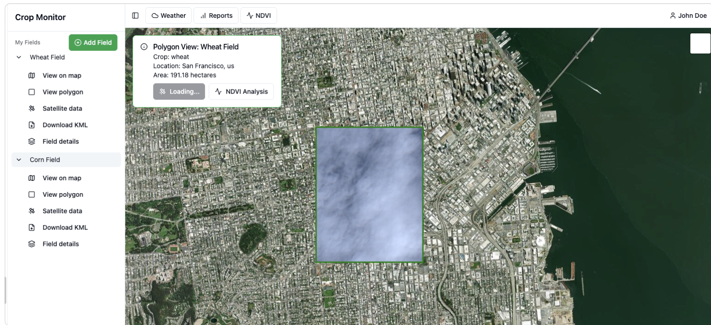
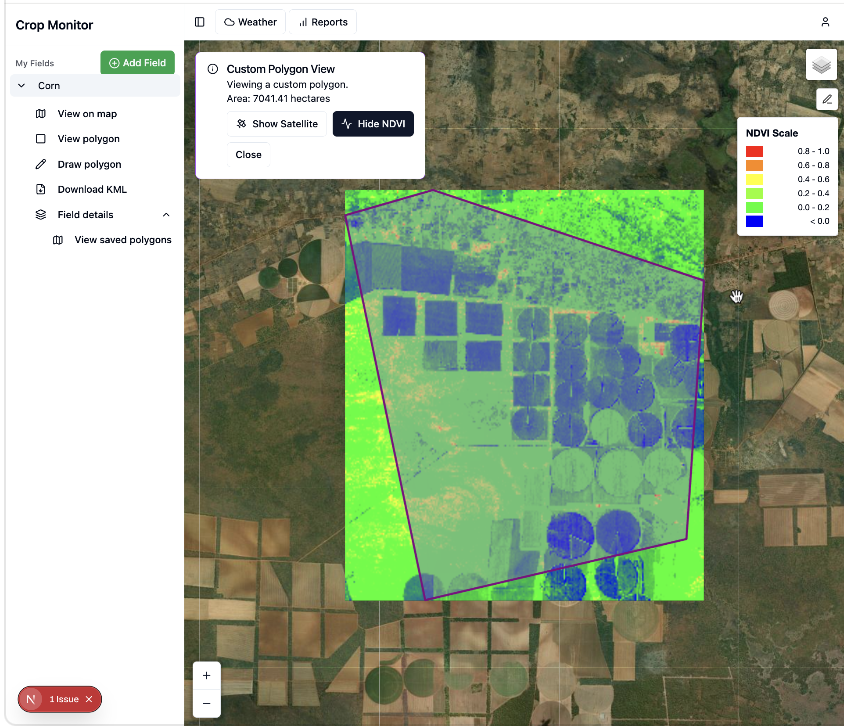

# Crop Monitoring App

A modern web application for agricultural monitoring and crop management. This application provides farmers and agricultural teams with real-time insights through interactive mapping, data visualization, and comprehensive crop analytics.

## Features

- **Interactive Mapping** - Visualize crop fields with detailed geospatial tools powered by Leaflet
- **Data Analytics** - Monitor crop performance with interactive charts and metrics
- **Field Management** - Draw and manage field boundaries with mapping tools
- **Responsive Design** - Access from desktop or mobile devices with a modern UI

## Tech Stack

Built with [Next.js](https://nextjs.org) and TypeScript for a fast, scalable, and type-safe application. The frontend leverages:
- **UI Components** - Radix UI for accessible component primitives
- **Styling** - Tailwind CSS for utility-first design
- **Mapping** - Leaflet and React Leaflet for geospatial visualization
- **Charts** - Recharts for data visualization and analytics





## Getting Started

First, run the development server:

```bash
npm run dev
# or
yarn dev
# or
pnpm dev
# or
bun dev
```

Open [http://localhost:3000](http://localhost:3000) with your browser to see the result.

You can start editing the page by modifying `app/page.tsx`. The page auto-updates as you edit the file.


